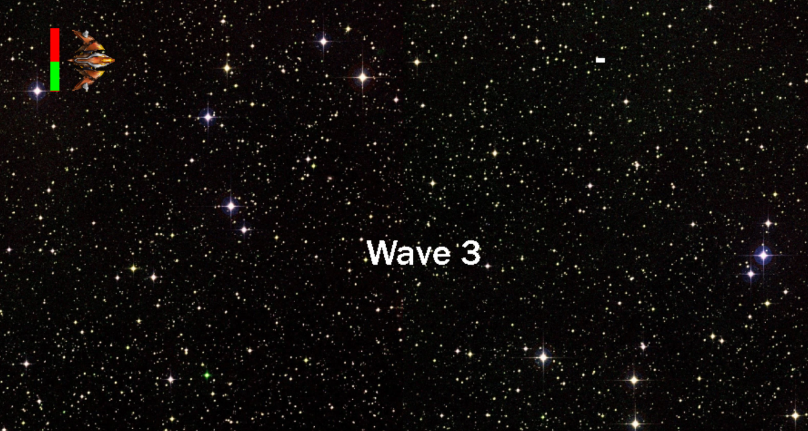

# 👾 Retro Space Invaders - Video Game

<h2>Description</h2>
This is a 2D arcade-style space shooter game developed in Python using Pygame. The player controls a battleship that must survive wave after wave of enemy ships, collecting power-ups and dodging enemy fire. The game features a scrolling background, high score tracking, power-ups, and two-player mode,  all wrapped in a pixel-art-inspired retro design.

 

<h2>Languages and Tools Used</h2>

- <b>Python</b> (Pygame framework)
- <b>Pygame</b> for game logic, animation, and collision detection
- <b>Pixel Art Generator</b> for custom retro button graphics

<h2>Development Environment</h2>

- <b>Python 3.x</b>
- <b>Pygame 2.x</b>
- <b>VS Code</b> for development and debugging

<h2>🎮 Program Walk-Through</h2>

### 1. Game Structure & Decomposition

The game is modularly designed with clear decomposition:
- **Player**: Movement, shooting, health tracking
- **Enemies**: Spawning, movement patterns, collision detection
- **Lasers**: Both player and enemy lasers with hit detection
- **Menus**: Main, pause, and options
- **Power-ups**: Timed collectibles affecting gameplay
- **Game modes**: Randomised behaviours for enemy waves

_A visual of how gameplay elements were broken down into manageable parts._

---

###  2. Main Menu and Navigation Flow

The game begins with a retro-inspired main menu allowing the player to:
- Start single or two-player mode
- View controls
- Toggle settings or exit

Menus are consistent in styling and flow for smooth navigation.

---

###  3. Player & Enemy Mechanics

- The player ship moves with WASD and shoots projectiles using the spacebar.
- Enemies spawn randomly or in grid formations depending on the game mode.
- Collision logic removes ships on impact and updates health/status bars.

---

### 4. Scrolling Background & Immersion

instead of moving the spaceship or enemies across space, the background itself moves, creating the illusion of motion while the player’s ship stays in place.
For example in the image below, it looks like the airplane is flying forward, but really, the airplane stays still while the background scrolls from right to left. This is the same technique I used in the game to simulate action in space

---

### 5. Power-Ups and Collisions

- Power-ups randomly appear and must be collected before expiring.
- Different effects can be added (e.g., laser upgrades or temporary invincibility)

---

### 6. High Scores and Game Progression

- A high-score tracker updates when a new wave is surpassed.
- Difficulty increases with each wave via faster enemies or denser attack patterns.

---

### 7. Two Player Mode

- Fully implemented second player with unique controls and health tracking.
- Victory is determined when one ship survives longer than the other.

---

### 8. Testing and Reliability

The game has been rigorously tested across:
- Menu navigation
- Collision detection
- Player/enemy mechanics
- Power-up logic
- Game mode switching
- High-score tracking

Test cases ensure that every core mechanic functions as expected throughout different playthroughs.
